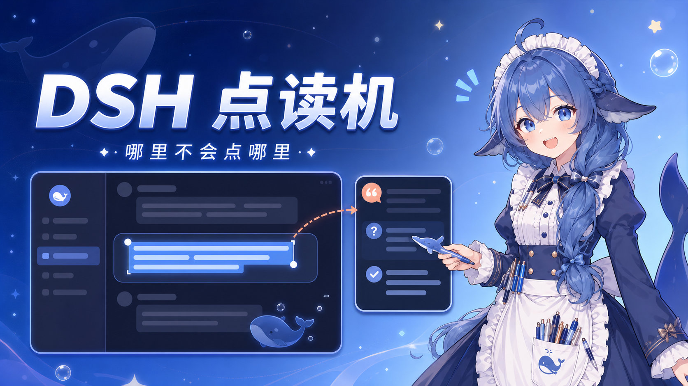

# DSH Selection Ask

[简体中文](README.md) | [English](README_EN.md)



为 [DeepSeek Harness](https://github.com/deepseek-ai/deepseek-harness) Web UI 增加“选中文字后结合当前对话上下文追问”的独立插件。

特性：

- 鼠标选中文字后显示嵌入式提问面板；
- 从当前对话的最近完整回答处分叉，沿用当前模型和上下文；
- 问答保存在隐藏的子对话中，不污染原对话；
- 当前对话有历史记录时，显示独立右侧栏入口；切换对话后只显示对应记录；
- 插件同时包含 DSH bundle patch 和浏览器客户端，可作为一个 `.tgz` 安装。

## 使用指南：DSH 上下文点读机

> **DSH 上下文点读机，哪里不会点哪里。** 当然不是拿鼠标把显示器戳出指纹——框选文字就行。

1. 打开一个已经聊过几轮的 DSH 对话。插件会从最近一次完整回答处分叉，因此模型不仅看得到你选中的句子，也记得这句话前面发生了什么。
2. 用鼠标框选想追问的文字。选完后，旁边会冒出一个 **“询问选中文本”** 按钮，像课代表一样主动举手。
3. 点击按钮后，可以直接选择 **解释、总结、翻译**，也可以自己输入更具体的问题。例如：“这个参数为什么是 `1.0`？”或“这句话在当前方案里有什么风险？”
4. 点击 **询问**，或者按 `Ctrl+Enter` 发送。插件会建立一个隐藏的子对话，沿用当前模型和上下文完成回答，不会把引用问答塞进原对话里假装什么都没发生。
5. 回答会显示在独立面板中。完成过至少一次引用问答后，页面右上方会出现 **“引用问答”** 入口；打开后即可在独立右侧栏里翻看往期记录。
6. 右侧栏与原对话一一绑定。切换到别的对话时，它不会追着你跑；切回来，之前点读过的内容仍然在。

一句话版：**哪里不会选哪里，选完就问；点的不是屏幕，是上下文。**

## 安装发布包（推荐）

### 环境要求

- Node.js 22.19+ 或 24+；
- Corepack/pnpm；`dsh plugin` 会调用 pnpm，因此 `pnpm` 必须能在终端中直接运行；
- 已经配置好可正常启动的 DeepSeek Harness Web UI。

先检查环境：

```powershell
node --version
corepack enable
pnpm --version
```

将 `<release-url>` 换成 GitHub Release 中 `.tgz` 资产的直链：

```powershell
dsh plugin --profile web add <release-url>
```

例如：

```powershell
dsh plugin --profile web add https://github.com/gethshap/dsh-selection-ask/releases/download/v0.1.0/gethshap-dsh-selection-ask-0.1.0.tgz
```

重启 Web 服务后生效：

```powershell
dsh web
```

如果尚未全局安装 `dsh`，可以通过 `npx` 完成安装和启动：

```powershell
npx -y @deepseek-ai/dsh@0.1.1-rc.2 plugin --profile web add https://github.com/gethshap/dsh-selection-ask/releases/download/v0.1.0/gethshap-dsh-selection-ask-0.1.0.tgz
npx -y @deepseek-ai/dsh@0.1.1-rc.2 web
```

### 验证插件是否加载

查看合并后的 Web 配置：

```powershell
dsh --profile web --dump-config
```

使用 `npx` 的用户可运行：

```powershell
npx -y @deepseek-ai/dsh@0.1.1-rc.2 --profile web --dump-config
```

输出中出现下面的配置即表示插件已加入 Web bundle：

```yaml
- id: ui-selection-ask
  name: '@gethshap/dsh-selection-ask'
```

如果安装后没有看到插件，请确认 `pnpm --version` 能正常执行，然后完全停止并重新启动 `dsh web`。

删除插件：

```powershell
dsh plugin --profile web remove @gethshap/dsh-selection-ask
```

## 从源码安装

首次从源码部署时，需要先克隆、安装依赖并构建，不能在刚克隆完成时直接安装目录：

```powershell
git clone https://github.com/gethshap/dsh-selection-ask.git
cd dsh-selection-ask
corepack pnpm install
corepack pnpm test
corepack pnpm run build
dsh plugin --profile web add .
dsh web
```

正式打包 Release 时再运行：

```powershell
corepack pnpm run pack:release
```

产物位于 `dist/gethshap-dsh-selection-ask-0.1.0.tgz`。发布 Git tag（例如 `v0.1.0`）后，GitHub Actions 会重新测试、打包并自动创建 Release、上传该文件。

## 开发安装

也可以安装一个已经执行过 `corepack pnpm run build` 的本地目录：

```powershell
dsh plugin --profile web add D:\path\to\dsh-selection-ask
```

每次修改后先运行 `corepack pnpm run build`，再重启 `dsh web`。正式安装已构建的 `.tgz` 后，日常启动不需要重复构建。

## 兼容性

插件最初面向 DSH `0.1.0-rc.7` 的公开客户端 API 开发，并已在 DSH `0.1.1-rc.2` 上完成以下兼容性验证：

- 安装现有 `v0.1.0` Release 包；
- TypeScript 构建和单元测试；
- Web 配置合并、服务启动和插件客户端加载；
- 浏览器端插件 UI 挂载，控制台无插件错误。

插件没有修改 DSH 核心源码，也不依赖私有 workspace 路径。DeepSeek Harness 目前仍处于 Developer Preview 阶段，后续 RC 版本可能出现破坏性变化；升级 DSH 后建议按上面的步骤检查合并配置并实际打开一次引用问答。

## License

MIT
