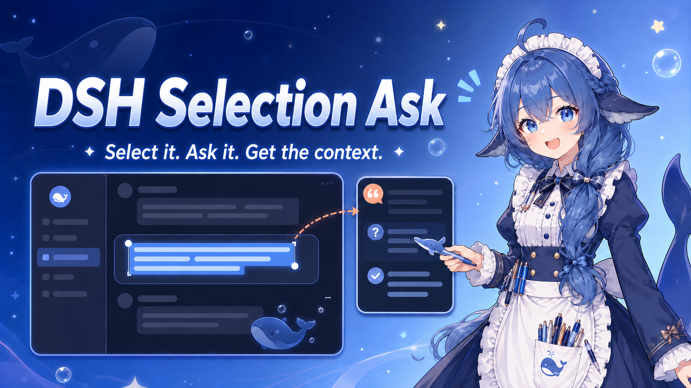

# DSH Selection Ask

[简体中文](README.md) | [English](README_EN.md)



A standalone [DeepSeek Harness](https://github.com/deepseek-ai/deepseek-harness) Web UI plugin for asking context-aware questions about selected text.

Features:

- Shows an embedded question panel when text is selected;
- Forks from the latest completed turn of the current conversation, preserving its model and context;
- Stores each answer in a hidden child conversation without polluting the original conversation;
- Provides a dedicated right sidebar for previous selected-text questions;
- Binds history to its source conversation, so only the relevant sidebar appears when switching conversations;
- Ships the DSH bundle patch and browser client together as one installable `.tgz` package.

## Install a Release (Recommended)

### Requirements

- Node.js 22.19+ or 24+;
- Corepack/pnpm. `dsh plugin` invokes pnpm, so `pnpm` must be available on `PATH`;
- A configured DeepSeek Harness Web UI that can already start successfully.

Check the environment first:

```powershell
node --version
corepack enable
pnpm --version
```

Replace `<release-url>` with the direct URL of a `.tgz` asset from GitHub Releases:

```powershell
dsh plugin --profile web add <release-url>
```

For example:

```powershell
dsh plugin --profile web add https://github.com/gethshap/dsh-selection-ask/releases/download/v0.1.0/gethshap-dsh-selection-ask-0.1.0.tgz
```

Restart the Web UI after installation:

```powershell
dsh web
```

If `dsh` is not installed globally, use `npx` for both installation and startup:

```powershell
npx -y @deepseek-ai/dsh@0.1.1-rc.2 plugin --profile web add https://github.com/gethshap/dsh-selection-ask/releases/download/v0.1.0/gethshap-dsh-selection-ask-0.1.0.tgz
npx -y @deepseek-ai/dsh@0.1.1-rc.2 web
```

### Verify the Installation

Inspect the merged Web profile configuration:

```powershell
dsh --profile web --dump-config
```

When using `npx`, run:

```powershell
npx -y @deepseek-ai/dsh@0.1.1-rc.2 --profile web --dump-config
```

The plugin has joined the Web bundle when the output contains:

```yaml
- id: ui-selection-ask
  name: '@gethshap/dsh-selection-ask'
```

If the plugin does not appear after installation, make sure `pnpm --version` works, then stop and restart `dsh web` completely.

To remove the plugin:

```powershell
dsh plugin --profile web remove @gethshap/dsh-selection-ask
```

## Install from Source

On the first source installation, clone the repository, install its dependencies, and build it before adding the local directory:

```powershell
git clone https://github.com/gethshap/dsh-selection-ask.git
cd dsh-selection-ask
corepack pnpm install
corepack pnpm test
corepack pnpm run build
dsh plugin --profile web add .
dsh web
```

To produce a release archive, additionally run:

```powershell
corepack pnpm run pack:release
```

The package is written to `dist/gethshap-dsh-selection-ask-0.1.0.tgz`. Pushing a Git tag such as `v0.1.0` triggers GitHub Actions to test and build the project, create a Release, and upload the package automatically.

## Development Installation

You can also install a local checkout that has already been built with `corepack pnpm run build`:

```powershell
dsh plugin --profile web add D:\path\to\dsh-selection-ask
```

After making changes, run `corepack pnpm run build` and restart `dsh web`. A normal installation from a prebuilt `.tgz` does not need to be rebuilt on every launch.

## Compatibility

The plugin was originally developed against the public client APIs in DSH `0.1.0-rc.7`. It has also been compatibility-tested with DSH `0.1.1-rc.2`, including:

- Installing the existing `v0.1.0` release archive;
- TypeScript compilation and unit tests;
- Web configuration merging, server startup, and plugin client loading;
- Browser-side plugin UI mounting without plugin console errors.

The plugin does not modify DeepSeek Harness core source code or depend on private workspace paths. DeepSeek Harness is still a Developer Preview, so later RC releases may introduce breaking changes. After upgrading DSH, inspect the merged configuration as shown above and perform one real selected-text question as a smoke test.

## Security Model

Selected text is treated as untrusted quoted data. Each question is sent through an isolated child conversation with instructions that prohibit tool use, command execution, file changes, and external actions.

## License

MIT
